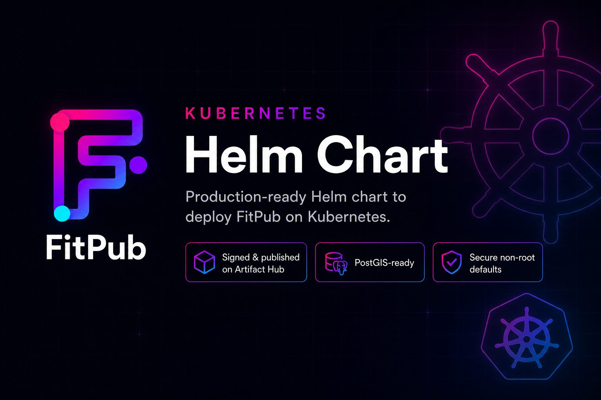

<p align="center">
  
</p>

<h1 align="center">FitPub Helm Chart</h1>

<p align="center">
  Helm chart for <a href="https://codeberg.org/fitpub/fitpub">FitPub</a>, a federated fitness tracking platform.<br>
  Live instance: <a href="https://fitpub.social"><strong>fitpub.social</strong></a>
</p>

<p align="center">
  <a href="https://fitpub.social"></a>
  <a href="https://artifacthub.io/packages/search?repo=fitpub"></a>
  
  
  <a href="LICENSE"></a>
</p>

<p align="center">
  <a href="https://github.com/oliinykdm/fitpub-helm/actions/workflows/helm-lint-and-test.yaml"></a>
  <a href="https://github.com/oliinykdm/fitpub-helm/actions/workflows/runtime-smoke-test.yaml"></a>
  <a href="https://github.com/oliinykdm/fitpub-helm/actions/workflows/release.yaml"></a>
  
  
</p>

> **Status:** unofficial, production-oriented, and still moving. Read the values before you point it at a public instance. You have been warned.

## What CI checks

- `ct lint` on every change
- Render tests against default values, `examples/production-values.yaml`, and `examples/networkpolicy-smoke-values.yaml`
- Kubernetes API validation in kind with `kubectl apply --dry-run=server`
- **Kind runtime test** (the *Kind Runtime Test* badge): on every PR, every push to `main`, and once a week. Spins up kind + PostGIS, runs `helm install --wait`, waits for the pod to go Ready, and curls `GET /login` for an HTTP 200 (FitPub **1.1.1**). A second job does the same under restricted NetworkPolicy egress.
- Releases ship signed packages and an `index.yaml` to GitHub Pages

So: linted, rendered, and actually booted against a real database. Not the same as years of public traffic, but a lot better than "works on my machine".

## Features

- Runs as the non-root FitPub user (`1001`), restricted Pod Security Standard compliant out of the box
- `readOnlyRootFilesystem` on by default, with `/tmp` and `/app/logs` backed by emptyDir
- PersistentVolumeClaim for uploads at `/app/uploads`
- Optional Secret mount for Markdown legal/about pages at `/app/pages`
- ConfigMap/Secret split for plain and secret environment variables
- Probes on `GET /login` (actuator health needs auth on 1.1.x, see [docs/troubleshooting.md](docs/troubleshooting.md))
- CPU/memory limits, a PodDisruptionBudget, and a preStop drain hook on by default
- Optional Ingress, HPA, NetworkPolicy and ServiceMonitor
- Extension points for extra env, envFrom, volumes, mounts, init containers and sidecars
- Brings its own app, but not its database - you supply PostgreSQL with PostGIS

## Quick start (local)

Just want to see it run on kind/minikube/Docker Desktop without standing up a
database first? From the repo root:

```bash
scripts/local-quickstart.sh
```

It throws up a disposable PostGIS, installs the chart, waits for it to go healthy,
and tells you how to reach it. The manual steps and a troubleshooting table live in
[docs/quickstart.md](docs/quickstart.md).

## Prerequisites

- Kubernetes 1.26+
- Helm 3.8+
- External PostgreSQL with PostGIS enabled. A plain PostgreSQL database is not enough.

## Installation

The chart ships two ways. Pick one.

**OCI registry (recommended).** No `helm repo add`, just point at the package:

```bash
helm install fitpub oci://ghcr.io/oliinykdm/charts/fitpub --version 0.4.0 -f production-values.yaml
```

The OCI artifact carries the GPG provenance, so you can verify it on pull:

```bash
helm pull oci://ghcr.io/oliinykdm/charts/fitpub --version 0.4.0 --verify \
  --keyring <(curl -fsSL https://oliinykdm.github.io/fitpub-helm/pgp-public-key.asc | gpg --dearmor)
```

**Classic HTTP repo (GitHub Pages).** Still published for tooling that expects it:

```bash
helm repo add fitpub https://oliinykdm.github.io/fitpub-helm
helm repo update
helm install fitpub fitpub/fitpub -f production-values.yaml
```

Either way, copy [examples/production-values.yaml](examples/production-values.yaml) and adapt it first.

Or install straight from a checkout while hacking on the chart:

```bash
git clone https://github.com/oliinykdm/fitpub-helm.git
cd fitpub-helm
helm install fitpub ./charts/fitpub -f examples/production-values.yaml
```

The repository install still expects an external PostGIS database and a pre-created
Secret when using `examples/production-values.yaml`. For a working local instance
without manual wiring, use `scripts/local-quickstart.sh` instead.

## Configuration

Non-secret settings go into `config` and are rendered into a ConfigMap. Secrets go into `applicationSecret.data` or, preferably for production, into an existing Kubernetes Secret referenced by `applicationSecret.existingSecret`.

Minimum production values (use an external Secret - do not commit real credentials to Git):

```yaml
productionChecks:
  enabled: true

config:
  FITPUB_DATABASE_URL: "jdbc:postgresql://postgres:5432/fitpub"
  FITPUB_DOMAIN: "your-domain.com"
  # Must not end with a slash.
  FITPUB_BASE_URL: "https://your-domain.com"
  FITPUB_PUSH_ENABLED: "false"
  # When enabling mail, set FITPUB_MAIL_HOST together with port/auth/starttls - see production-values.yaml.
  FITPUB_MAIL_HOST: "smtp.example.com"
  FITPUB_MAIL_PORT: "587"
  FITPUB_MAIL_SMTP_AUTH: "true"
  FITPUB_MAIL_STARTTLS_ENABLE: "true"
  FITPUB_MAIL_STARTTLS_REQUIRED: "true"

applicationSecret:
  existingSecret: fitpub-secret
```

Create the Secret before install (inline `applicationSecret.data` is for controlled testing only - see [examples/chart-managed-secret-values.yaml](examples/chart-managed-secret-values.yaml)):

```bash
kubectl create secret generic fitpub-secret -n fitpub \
  --from-literal=FITPUB_DATABASE_USERNAME=fitpub \
  --from-literal=FITPUB_DATABASE_PASSWORD="$(openssl rand -base64 32)" \
  --from-literal=FITPUB_JWT_SECRET="$(openssl rand -base64 64)" \
  --from-literal=FITPUB_EMAIL_SECRET="$(openssl rand -base64 64)" \
  --from-literal=FITPUB_MAIL_USERNAME="smtp-user" \
  --from-literal=FITPUB_MAIL_PASSWORD="smtp-password"
```

The mail user/password are only there because the example sets `FITPUB_MAIL_SMTP_AUTH: "true"`.

`productionChecks.enabled=true` fails the render early when a required public setting, a chart-managed secret, or part of the push-notification config is missing. Cheaper than a CrashLoopBackOff.

Optional tuning keys (Hikari pool, ActivityPub inbox processing, `FITPUB_MAIL_PROTOCOL`, `FITPUB_OSM_TILES_ENABLED`, `FITPUB_WEATHER_ENABLED`, and others) are listed in [values.yaml](charts/fitpub/values.yaml). Leave them empty to use application defaults.

See [values.yaml](charts/fitpub/values.yaml) and [examples/production-values.yaml](examples/production-values.yaml) for available options.

Additional examples:

- [examples/production-values.yaml](examples/production-values.yaml): production-style values with an externally managed Secret
- [examples/chart-managed-secret-values.yaml](examples/chart-managed-secret-values.yaml): controlled testing values where Helm creates the Secret
- [examples/development-values.yaml](examples/development-values.yaml): development-style values for throwaway clusters
- [examples/runtime-smoke-values.yaml](examples/runtime-smoke-values.yaml): CI-only values used by the runtime smoke test
- [examples/networkpolicy-smoke-values.yaml](examples/networkpolicy-smoke-values.yaml): CI-only values for restricted NetworkPolicy egress

## Extending The Pod

The chart exposes common extension points without editing templates:

```yaml
extraEnv:
  - name: JAVA_TOOL_OPTIONS
    value: "-XX:MaxRAMPercentage=70"

extraEnvFrom: []
extraInitContainers: []
sidecars: []
volumes: []
volumeMounts: []
nodeSelector: {}
tolerations: []
affinity: {}
topologySpreadConstraints: []
```

Use these for platform integrations such as sidecar agents, projected Secrets, custom CA bundles or cluster scheduling rules.

## Ingress

Enable Ingress when exposing FitPub publicly:

```yaml
ingress:
  enabled: true
  className: traefik
  annotations:
    cert-manager.io/cluster-issuer: letsencrypt-prod
  hosts:
    - host: fitpub.example.com
      paths:
        - path: /
          pathType: Prefix
  tls:
    - secretName: fitpub-tls
      hosts:
        - fitpub.example.com
```

Set `className` to the ingress controller used by your cluster. The example uses Traefik as a common self-hosted default.

FitPub's production profile enables `server.forward-headers-strategy: framework` and reads `X-Forwarded-For` and `X-Forwarded-Proto` from your ingress or reverse proxy. Configure the controller to pass those headers on HTTPS termination so generated URLs, redirects and ActivityPub endpoints use the correct public scheme.

## Markdown Pages

FitPub can read Markdown pages from `/app/pages`. To provide Kubernetes-native legal pages, create a Secret from files and mount it:

```bash
kubectl create secret generic fitpub-pages \
  --from-file=terms.md \
  --from-file=imprint.md \
  --from-file=about.md
```

```yaml
pages:
  existingSecret: fitpub-pages
```

Secret updates do not automatically restart the pod. Restart the Deployment if the application does not pick up changed files.

## Persistence

By default, the chart creates a `PersistentVolumeClaim` for user uploads at `/app/uploads`.

You can customize storage size and class:

```yaml
persistence:
  enabled: true
  storageClass: ""
  size: 10Gi
```

You can also reuse an existing claim:

```yaml
persistence:
  enabled: true
  existingClaim: fitpub-uploads
```

Back up the uploads PVC and the external PostGIS database regularly.

## Application Logs

In the `prod` profile FitPub writes rotated file logs to `/app/logs/`. The chart
mounts that path as an emptyDir, so the read-only root filesystem stays happy and
logs survive container restarts - but not pod rescheduling. emptyDir is scratch
space, not a shoebox under the bed.

For anything you want to keep, lean on your cluster log collector (stdout carries
the same lines) or ship `/app/logs` with a sidecar. To grow or shrink the buffer:

```yaml
ephemeralVolumes:
  logs:
    sizeLimit: 512Mi
```

## Replicas And Scaling

Default is `replicaCount: 1` with a `Recreate` strategy. Not because the app falls
over with more pods - the background schedulers claim work with row locks and the
cleanups are idempotent, so they are safe to run concurrently. The real blocker is
the uploads volume: `ReadWriteOnce` can only mount on one pod at a time.

To actually scale out, give uploads a `ReadWriteMany` storage class and then enable
`autoscaling`. The chart refuses `replicaCount > 1` on RWO storage so you find out
at install time, not at 3am.

## Memory And JVM

The image runs Java 25 with `-XX:MaxRAMPercentage=75` against the cgroup memory
**limit**. The chart pins request and limit to the same value so the scheduler
reserves enough for heap plus native overhead, and adds a CPU limit to keep GC and
Flyway bursts from stealing a whole core:

```yaml
resources:
  requests:
    cpu: 250m
    memory: 3072Mi
  limits:
    cpu: 1500m
    memory: 3072Mi
```

OOMKilled pods or sluggish Flyway on tiny nodes? Raise `resources.limits.memory`
or hand the JVM a smaller slice:

```yaml
extraEnv:
  - name: JAVA_TOOL_OPTIONS
    value: "-XX:MaxRAMPercentage=60"
```

## NetworkPolicy

Off by default. FitPub needs egress to PostgreSQL, SMTP and a long tail of
federated/external HTTP hosts, so a half-configured policy mostly just breaks
things. Turn it on once you are ready to list those dependencies.

Two things worth knowing before you enable it:

- It assumes a conntrack-stateful engine (Calico, Cilium, and friends). A
  non-stateful one can drop reply traffic like DNS answers.
- Some enforcers are picky about DNS even when you "allow all" egress. We caught
  kindnet (kind, recent builds) dropping UDP 53 to the cluster DNS under a bare
  allow-all rule, which surfaces as `UnknownHostException` on the database host.
  If DNS breaks, allow it explicitly - to kube-system on UDP/TCP 53 - and confirm
  egress works on your CNI before trusting it in prod.

Keep `networkPolicy.ingress.enabled=true` unless you add
`networkPolicy.ingress.extraRules`. Turning ingress off with no rules locks
everyone out, FitPub included.

Example shape for restricted egress:

```yaml
networkPolicy:
  enabled: true
  egress:
    allowAll: false
    extraRules:
      - to:
          - namespaceSelector:
              matchLabels:
                kubernetes.io/metadata.name: database
        ports:
          - protocol: TCP
            port: 5432
      - to:
          - namespaceSelector:
              matchLabels:
                kubernetes.io/metadata.name: kube-system
            podSelector:
              matchLabels:
                k8s-app: kube-dns
        ports:
          - protocol: UDP
            port: 53
          - protocol: TCP
            port: 53
      # ClusterIP DNS (some CNIs match policy before DNAT) - UDP and TCP 53.
      - to:
          - ipBlock:
              cidr: 10.96.0.0/12
        ports:
          - protocol: UDP
            port: 53
          - protocol: TCP
            port: 53
      # SMTP to your mail relay (restrict `to:` in production).
      - ports:
          - protocol: TCP
            port: 587
      # HTTPS for federation.
      - ports:
          - protocol: TCP
            port: 443
```

Adjust this to your actual PostgreSQL, DNS, SMTP, HTTPS federation and peer egress model.

## Graceful Shutdown

Kubernetes sends `SIGTERM` and yanks the pod from endpoints at the same moment, which
can leave a few in-flight requests hitting a dying pod. The chart already ships a
5-second `preStop` sleep to cover that window. Bump it if your ingress drains slowly:

```yaml
lifecycleHooks:
  preStop:
    exec:
      command: ["sh", "-c", "sleep 10"]
```

Scheduling knobs (`priorityClassName`, `nodeSelector`, `tolerations`, `affinity`, `topologySpreadConstraints`) pass straight through - see `values.yaml`.

## Debugging

Enable `diagnosticMode` to run the container as `sleep infinity` so you can exec in without startup or probe failures blocking access:

```bash
helm upgrade fitpub fitpub/fitpub \
  --reuse-values \
  --set diagnosticMode.enabled=true

kubectl exec -it deployment/fitpub -n fitpub -- sh
```

Disable it again when done:

```bash
helm upgrade fitpub fitpub/fitpub \
  --reuse-values \
  --set diagnosticMode.enabled=false
```

## Global Labels And Annotations

Add labels and annotations to every resource created by this chart:

```yaml
commonLabels:
  environment: production
  team: platform

commonAnnotations:
  reloader.stakater.com/auto: "true"
```

## Monitoring

Running Prometheus Operator? There is a `ServiceMonitor`:

```yaml
serviceMonitor:
  enabled: true
  labels:
    release: kube-prometheus-stack
```

Fair warning, it does not do much on FitPub **1.1.1** yet. The image ships no
`/actuator/prometheus`, and Spring Security gates every actuator endpoint behind
auth, so an anonymous scrape just gets a 302 and an empty target. The wiring is
here for when the app grows a public metrics endpoint - until then, leave it off
and do not read an empty target as "FitPub is down". The probes use `GET /login`
for exactly that reason. More in [docs/troubleshooting.md](docs/troubleshooting.md).

## Security Notes

The chart drops all Linux capabilities, disables privilege escalation, runs as
UID/GID `1001`, and mounts the root filesystem read-only. FitPub still needs to
write uploads, logs and temp files, so those paths get their own mounts: the
uploads PVC, plus emptyDir for `/tmp` and `/app/logs`. Everything else is locked.

### Pod Security Standards (`restricted`)

It passes `restricted` as shipped, no extra knobs required. The `volume-permissions`
init container is the one thing that would break it - it runs as root to chown the
uploads volume - so it is **off by default**. `fsGroup` handles ownership without it.

Only turn it back on for storage that ignores `fsGroup` (some NFS or hostPath setups):

```yaml
initContainers:
  volumePermissions:
    enabled: true
```

## Upgrade

Use the same adapted values file you installed with (commonly copied from
[examples/production-values.yaml](examples/production-values.yaml)):

```bash
helm upgrade fitpub fitpub/fitpub -f production-values.yaml
```

When changing ConfigMap or chart-managed Secret values, the Deployment rolls automatically because checksum annotations are included on the pod template.

Read [docs/upgrade-notes.md](docs/upgrade-notes.md) before upgrading across chart minor versions.

## Design Notes

This chart intentionally uses an external PostGIS database, a `Deployment` with a dedicated uploads PVC and a single-replica default. See [docs/design.md](docs/design.md) for the reasoning and current CI guarantees.

## GitOps

Flux and Argo CD examples are available in [docs/gitops.md](docs/gitops.md). Production GitOps setups should manage secrets through SOPS, External Secrets Operator, Sealed Secrets or a similar workflow.

## Troubleshooting

See [docs/troubleshooting.md](docs/troubleshooting.md) for common Kubernetes deployment problems: PostGIS issues, missing secrets, failing health probes, PVC permissions and federation URL mistakes.

## Production Checklist

The short version of everything above, for the copy-paste-into-a-ticket crowd:

- PostgreSQL **with PostGIS**, not plain PostgreSQL
- `productionChecks.enabled=true` so bad values fail at install, not at 3am
- Strong `FITPUB_DATABASE_PASSWORD`, `FITPUB_JWT_SECRET`, `FITPUB_EMAIL_SECRET` (`openssl rand -base64 48` is your friend)
- Using `applicationSecret.existingSecret`? Check it has every required key before install - the chart cannot peek inside it
- `FITPUB_BASE_URL` public, canonical, no trailing slash
- FitPub behind HTTPS
- Back up PostgreSQL and `/app/uploads` (the parts you cannot regenerate)
- Ship `/app/logs` somewhere if you want history - emptyDir does not survive rescheduling
- `FITPUB_PUSH_ENABLED=false` unless VAPID keys and `FITPUB_VAPID_SUBJECT` are set
- Leave `serviceMonitor` off until actuator scraping is authenticated or public in your image
- Want more than one replica? Switch uploads to `ReadWriteMany` first

This chart grew out of the Kubernetes manifests discussion in [FitPub issue #301](https://codeberg.org/fitpub/fitpub/issues/301).

## Contributing

For now this lives in a personal repo. If it settles into something stable, it can be
proposed upstream to FitPub on Codeberg. See [CONTRIBUTING.md](CONTRIBUTING.md) for the
workflow and design principles.
